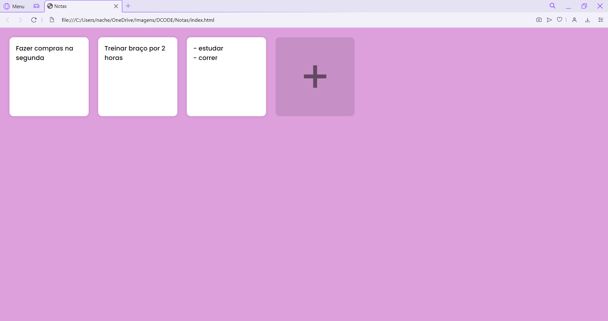
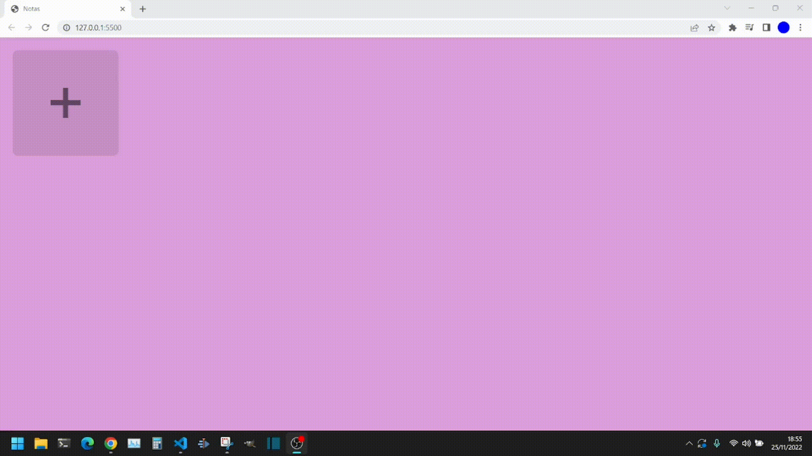

# Aplicativo de Notas Javascript

Este é um projeto em HTML, CSS e Javascript puro, que consiste em um aplicativo de Notas, onde você pode escrever lembretes e outros recados, este projeto também usa o recurso do banco de dados Local Storage.

- Funcionamento:

